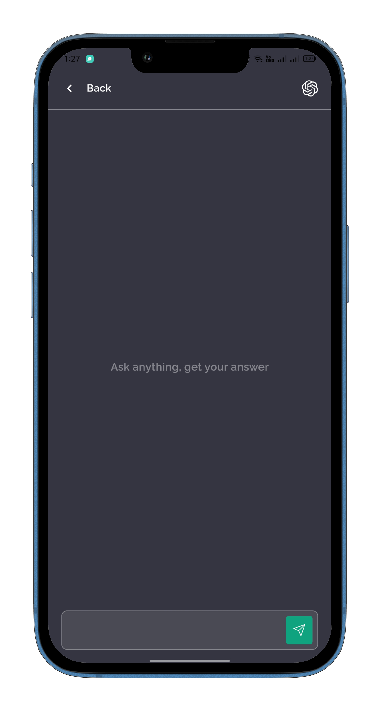

<h2 align="center"> 🚀 Ai Chat  App Features</h2>

1. **Create New Chat**:

   - Initiate conversations with ChatGPT on various topics.
   - Start a new chat session by selecting the topic you want to discuss.

2. **Chat with ChatGPT**:

   - Engage in meaningful conversations with ChatGPT.
   - Discuss topics ranging from Flutter development to advanced programming concepts.

3. **Delete Chat**:

   - Remove unwanted chat sessions from your conversation list.
   - Delete chats that you no longer need to declutter your interface.

4. **Clear Conversations**:
   - Clear all chat history with a single tap.
   - Keep your chat interface organized by removing old conversations.

<!-- Project Screenshots -->
<h2 align="center">📸 Project Screenshots 📸</h2>

   
    
    
    
    
    
    
    
    
  
  <!-- Add more screenshots... -->

<!-- Technologies Used -->
<h2 align="center">💡 Technologies Used</h2>

Built using cutting-edge technologies:

<ul>
  <li>Dart & Flutter</li>
  <li>get State Management</li>
  <!-- Add more technologies... -->
</ul>
>>>>>>> fc3c14cee4010d08d953c69a7c6ce75b8f263b0a
